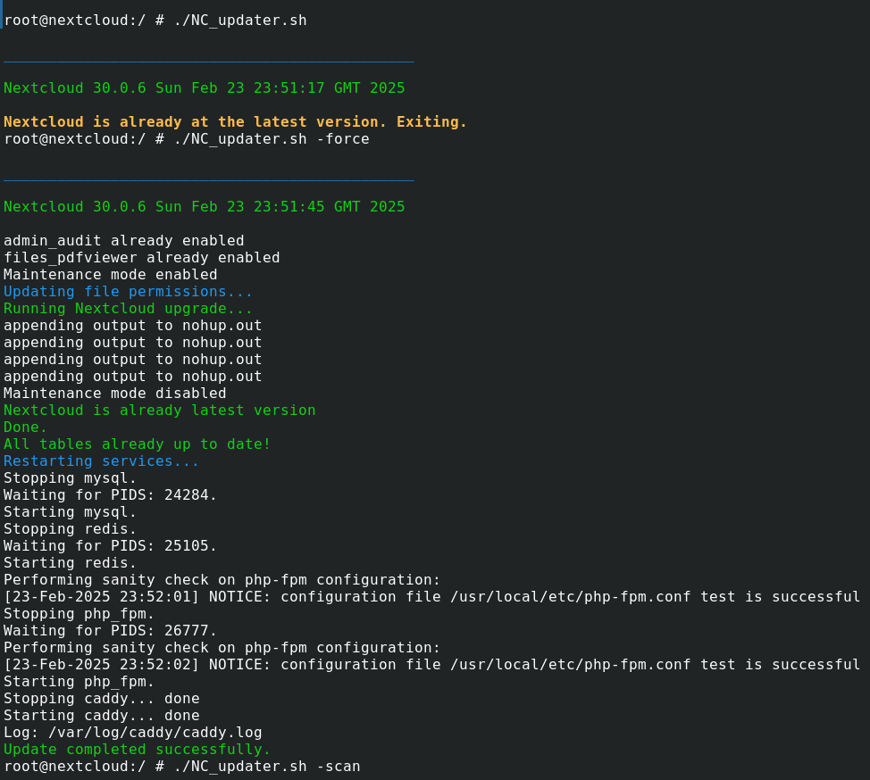
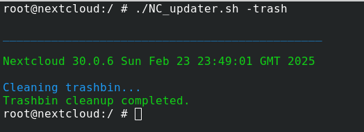
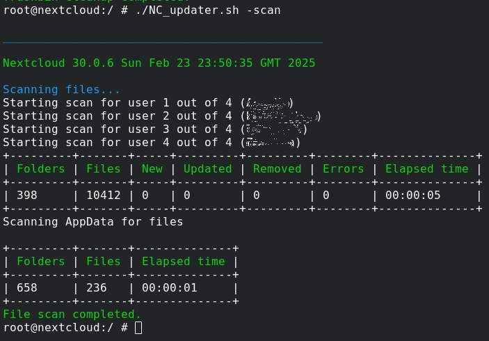

# NC_updater
NC_Updater.sh is a shell script for updating the Nextcloud Server inside the FreeNAS/TrueNAS Nextcloud jail.

This script will use OCC to search for update and if it is newer than the currently installed version the script will download and optionaly install the new version.
It will create a simple log file NC_Updater.log, to save some info for future reference.



## Installation

Download the NC_Updater.sh script in your jail:

```bash
  fetch https://raw.githubusercontent.com/AfroUSApl/NC_updater/refs/heads/main/NC_Updater.sh
  
```

Create folder "Updater" with writable permission:
```bash
  cd ..
  mkdir Updater
  chmod a+w Updater
```

## Usage

Run the script as root. The following options can be used:
```bash
   -trash    Script will only clean trashbins for all user
   -scan     Script will only scan files for all users
   -force    This option will force to run all task to update the script
```





When there is no option used, script will go ahead and check if there is a new update, if there is no new update it will stop and exit.
If new updater is detected, it will continue with all task to update Nextcloud to the newer version, with all necesarry steps.

The script can also be called from a cronjob to check for updates on a regular schedule.


## Troubleshooting

I did test the script on my TrueNAS 13-U7 and Nextcloud 30.0.6.
If you happen to find any errors, please open issu ticket

I did not install any additional packages to my iocage. 


## Sidenotes

I have installed my Nextcloud jail using this famous automatic script from [danb35](https://github.com/danb35/freenas-iocage-nextcloud), he done a great work making this!

Thanks to the [FreeNAS](https://www.truenas.com/community)/[TrueNAS](https://www.truenas.com/community) forums for all the help provided.

[Nextcloud](https://nextcloud.com/) is an amazing suite of client-server software for creating and using file hosting services, it provides functionality similar to Dropbox, Office 365, or Google Drive.

To address this I have made a script that can be copied into a running Nextcloud jail, and without needing anything else, it can search and check for newer versions. If a newer version is found it can automatically installed to the server.
